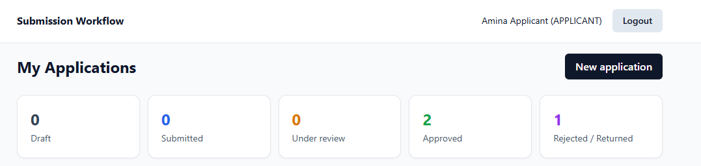
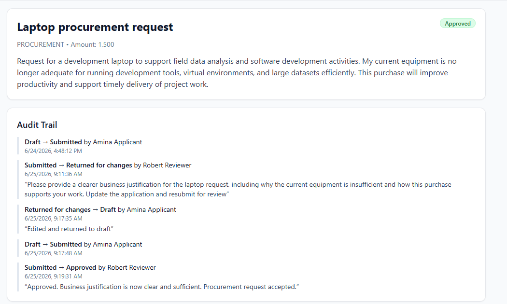
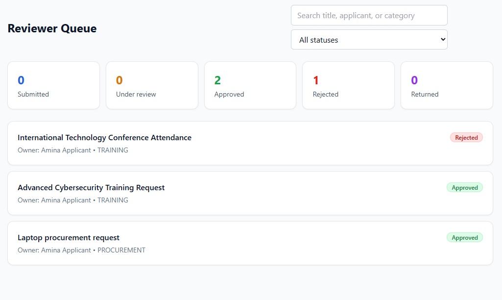
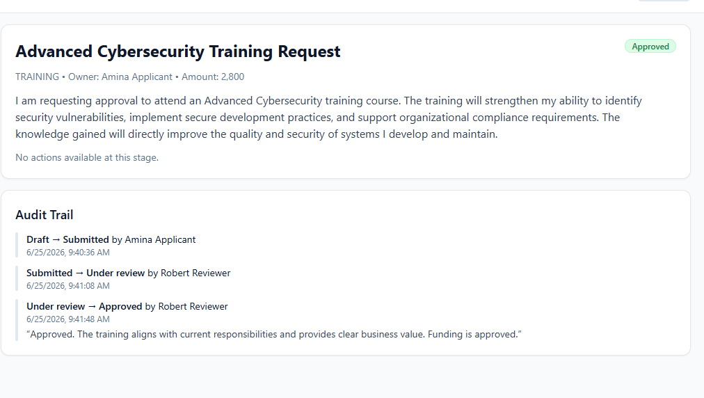
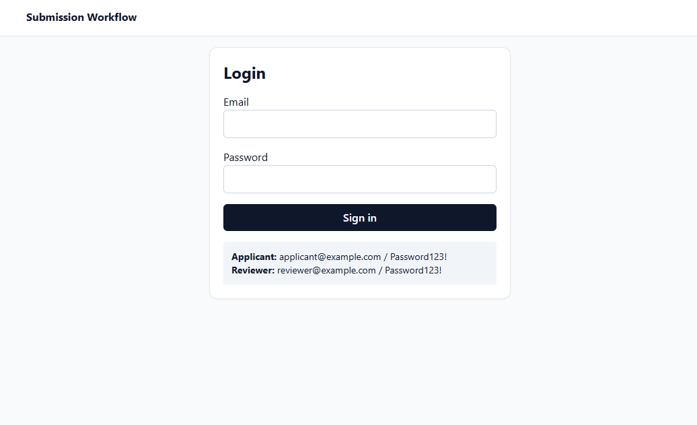

# Submission & Approval Workflow


A full-stack technical assessment implementing **Assignment B**: a two-sided request submission and approval workflow with server-enforced roles, a strict status state machine, and an immutable audit trail.

Applicants create and submit requests; reviewers move them through the workflow (start review, approve, reject, or return for changes). Every status change is recorded with the actor, timestamp, and an optional comment.

## Live Deployment

| Service | URL |
|---|---|
| **Frontend** (Vercel) | https://submission-approval-workflow.vercel.app |
| **Backend API** (Render) | https://submission-approval-workflow-backend.onrender.com |
| **Health endpoint** | https://submission-approval-workflow-backend.onrender.com/health |

### Test Credentials

| Role | Email | Password |
|---|---|---|
| Applicant | applicant@example.com | Password123! |
| Reviewer | reviewer@example.com | Password123! |

## Deployment Notes

- The backend is hosted on **Render** (free tier).
- The database is hosted on **Neon** (managed PostgreSQL, free tier).
- Because the Render and Neon free tiers suspend after inactivity, the **first request (such as login) may take around 30–60 seconds** while the services wake up.
- Once warmed up, subsequent requests are significantly faster.

## Architecture

- **Frontend:** React, TypeScript, Vite, Tailwind CSS — with TanStack Query and React Hook Form
- **Backend:** Express, TypeScript, Prisma ORM
- **Database:** PostgreSQL (Neon)
- **Authentication:** JWT
- **Local infrastructure:** Docker Compose
- **Testing:** Jest, Supertest

```text
React (Vercel)
        │
        ▼
Express API (Render)
        │
        ▼
Prisma ORM
        │
        ▼
PostgreSQL (Neon)
```

## Features

**Workflow & data**

- **Applicant workflow** — create, edit, and submit applications; revise and resubmit when returned for changes.
- **Reviewer workflow** — start review, approve, reject, or return applications for changes.
- **Workflow state machine** — a single source of truth that permits only legal status transitions.
- **Audit trail** — every status change is recorded immutably with actor, timestamp, and optional comment.

**Security & validation**

- **Server-side authorization** — every mutation is re-checked on the backend; the client is never trusted.
- **Role-based access control** — applicant and reviewer capabilities are strictly separated.
- **Validation** — request bodies and query parameters are validated with Zod.

**Frontend experience**

- **Confirmation modals** — reviewer actions (start review, approve, reject, return) require explicit confirmation.
- **Protected routes** — unauthenticated users are redirected to login instead of seeing failed loads.
- **Automatic redirect after workflow actions** — applicants return to their list after submitting; reviewers return to the queue after a decision.
- **Automatic logout on expired sessions** — a `401` response clears the session and redirects to login (Axios interceptor).
- **Reviewer search and filtering** — search by title, applicant name, or category, combined with a status filter.
- **Dashboard summary cards** — at-a-glance counts of applications by status.
- **Status badges** — color-coded badges for each workflow state.
- **Responsive UI** — a layout that adapts to small and large screens.

A suite of **37 automated backend tests** covers authentication, authorization, workflow transitions, validation, ownership, and the audit trail (see [Testing Strategy](#testing-strategy)).

## Screenshots

Screenshots are stored in `docs/screenshots/`.

**Applicant Dashboard**



**Application Detail**



**Reviewer Queue**



**Reviewer Detail**



**Login**



## Project Structure

```text
submission-approval-workflow/
├── backend/
│   ├── prisma/        # schema, migration, seed
│   ├── src/           # Express app, routes, controllers, services, middleware
│   └── tests/         # Jest unit + Supertest API tests
├── frontend/
│   └── src/           # React pages, components, API client
├── docs/
│   └── screenshots/   # README screenshots
├── docker-compose.yml # local PostgreSQL
└── README.md
```

## Local Setup

### Prerequisites

- Node.js 18+
- Docker (for PostgreSQL)

### 1. Install dependencies

```bash
npm --prefix backend install
npm --prefix frontend install
```

### 2. Start PostgreSQL

```bash
docker compose up -d
```

This starts PostgreSQL on host port `5434` (mapped to the container's `5432`).

### 3. Configure environment

```bash
cp backend/.env.example backend/.env
cp frontend/.env.example frontend/.env
```

The defaults match the Docker Compose database, so no edits are needed for local development.

### 4. Migrate and seed the database

```bash
cd backend
npm run prisma:generate
npm run prisma:deploy
npm run prisma:seed
```

The seed creates the two users above and one sample draft application.

### 5. Run the backend

```bash
npm run dev
```

Backend runs on `http://localhost:4000`.

### 6. Run the frontend

In a second terminal:

```bash
cd frontend
npm run dev
```

Frontend runs on `http://localhost:5173`.

## API Overview

All endpoints are prefixed with `/api`. Every route except login requires a valid JWT. Only the main endpoints are listed below.

| Method | Endpoint | Description |
|---|---|---|
| `POST` | `/auth/login` | Authenticate and receive a JWT |
| `GET` | `/applications/my` | List the current applicant's applications |
| `POST` | `/applications` | Create a draft application |
| `GET` | `/applications/:id` | View an application with its audit trail |
| `PUT` | `/applications/:id` | Edit a draft or returned application |
| `POST` | `/applications/:id/submit` | Submit an application for review |
| `GET` | `/reviewer/applications` | Reviewer queue (supports `status` and `search`) |
| `POST` | `/reviewer/applications/:id/{action}` | Reviewer action — `under-review`, `approve`, `reject`, or `return` |

## Data Model

Three tables, defined in `backend/prisma/schema.prisma`.

### User

A seeded account with a role that determines what they can do.

| Field | Notes |
|---|---|
| `id` | UUID primary key |
| `name` | Display name |
| `email` | Unique login identifier |
| `passwordHash` | bcrypt hash; never returned to the client |
| `role` | `APPLICANT` or `REVIEWER` |

### Application

A single submission and its current workflow state.

| Field | Notes |
|---|---|
| `id` | UUID primary key |
| `title` | Required, minimum 3 characters |
| `category` | Enum: `PROCUREMENT`, `GRANT`, `TRAVEL`, `TRAINING`, `OTHER` |
| `description` | Optional |
| `amount` | Optional, stored as `Decimal(12,2)` |
| `status` | Workflow state (see below), defaults to `DRAFT` |
| `ownerId` | The applicant who owns it |
| `createdAt` / `updatedAt` | Timestamps |

Indexed on `ownerId` and `status` to keep the applicant list and reviewer queue efficient.

### AuditLog

An append-only record of every status change.

| Field | Notes |
|---|---|
| `id` | UUID primary key |
| `applicationId` | The application that changed |
| `oldStatus` / `newStatus` | The transition |
| `comment` | Optional note (required for reject/return) |
| `performedById` | The user who made the change |
| `createdAt` | Timestamp |

Audit rows are only ever created, never updated or deleted, so the history is immutable.

## Workflow / State Machine

Statuses:

- `DRAFT`
- `SUBMITTED`
- `UNDER_REVIEW`
- `APPROVED`
- `REJECTED`
- `RETURNED_FOR_CHANGES`

Allowed transitions (the only legal moves):

| Action | From | To | Role | Comment |
|---|---|---|---|---|
| Submit | `DRAFT`, `RETURNED_FOR_CHANGES` | `SUBMITTED` | Applicant | — |
| Start review | `SUBMITTED` | `UNDER_REVIEW` | Reviewer | — |
| Approve | `SUBMITTED`, `UNDER_REVIEW` | `APPROVED` | Reviewer | — |
| Reject | `SUBMITTED`, `UNDER_REVIEW` | `REJECTED` | Reviewer | **Required** |
| Return for changes | `SUBMITTED`, `UNDER_REVIEW` | `RETURNED_FOR_CHANGES` | Reviewer | **Required** |

When a reviewer returns an application, the applicant can edit it (which moves it back to `DRAFT`) and resubmit, closing the loop. `APPROVED` and `REJECTED` are terminal states.

The rules live in a single state machine (`backend/src/services/workflowService.ts`). Every transition endpoint calls it, so the logic cannot drift between routes. Each rule check maps to a specific HTTP status:

- Wrong role → `403`
- Illegal transition for the current status → `409`
- Missing required comment → `400`

## Authorization Rules

Authorization is enforced **server-side on every request**. The UI hides actions a user can't take, but the API never trusts the client.

- All `/api` routes (except login) require a valid JWT.
- Only **applicants** can create, edit, or submit applications.
- An applicant can only act on applications they **own**, and can only view their own.
- An applicant can only edit an application while it is `DRAFT` or `RETURNED_FOR_CHANGES`; editing after submission returns `409`.
- Only **reviewers** can start review, approve, reject, or return.
- An applicant calling a reviewer endpoint directly receives `403`, even with a valid token.
- The create/edit input schema only accepts `title`, `category`, `description`, and `amount`, so a client cannot set `status` or `ownerId` directly.

### HTTP status codes

| Code | Meaning |
|---|---|
| `400` | Validation error (invalid body or query) |
| `401` | Missing or invalid token |
| `403` | Authenticated but not allowed |
| `404` | Resource not found |
| `409` | Illegal workflow transition |

All errors return a structured JSON body: `{ "message": "..." }` (validation errors also include field details).

## Security

- **JWT authentication** — stateless, signed, 8-hour tokens; every protected route verifies the token before handling the request.
- **bcrypt password hashing** — passwords are stored only as bcrypt hashes and are never returned to the client.
- **Server-side authorization** — role and ownership checks run on every mutation, independent of the UI.
- **Zod validation** — request bodies and query parameters are validated at the boundary, returning `400` on bad input.
- **Workflow state machine enforcement** — only transitions defined in the state machine are permitted; illegal moves return `409`.
- **Tamper protection** — the create/edit schema accepts only `title`, `category`, `description`, and `amount`, so a client cannot set `status` or `ownerId` to self-approve or seize ownership.

## Testing Strategy

Run the suite:

```bash
cd backend
npm test
```

The project currently contains **37 automated backend tests**. Coverage at a glance:

- ✓ Authentication
- ✓ Authorization
- ✓ Workflow transitions
- ✓ Illegal transitions
- ✓ Validation
- ✓ Ownership
- ✓ Audit trail
- ✓ HTTP status codes

The tests are organised across two layers:

- **Unit tests (`tests/workflowService.test.ts`)** exercise the state machine in isolation: every legal transition returns the correct next status, and every illegal one throws with the right HTTP status — covering role restrictions (`403`), illegal transitions (`409`), and required comments (`400`).
- **API tests (`tests/authz.test.ts`)** use Supertest against the real Express app and database to prove authorization is enforced, not assumed:
  - unauthenticated and invalid-token requests return `401`;
  - role segregation on list endpoints (`403`);
  - an applicant cannot approve/reject/return/start-review via direct API calls (`403`);
  - reject/return without a comment return `400`, and invalid query parameters are rejected with `400` (validation);
  - illegal transitions return `409`;
  - **ownership**: an applicant cannot view or edit another applicant's application (`403`);
  - **positive controls**: an owner can edit their own draft, and a reviewer's approval succeeds **and writes the expected audit log row** (audit log verification).

The positive controls matter as much as the negative ones: they confirm the workflow actually works and that the audit trail is written, rather than only checking that bad requests fail.

## Design Decisions

- **Centralized state machine.** All transition rules live in one service that controllers call, so behaviour is consistent across endpoints and easy to unit test.
- **Server-side authorization.** Role and ownership checks run on every mutation; the frontend is treated as untrusted.
- **Atomic status change + audit log.** Each transition updates the status and writes the audit row inside a single Prisma transaction, so a status can never change without being recorded.
- **Async error handling.** Express 4 does not forward rejected promises to error middleware, so async handlers are wrapped in a small `asyncHandler` utility. This ensures invalid actions return structured HTTP errors instead of hanging the request.
- **Input validation at the boundary.** Zod validates request bodies and query params, returning `400` for bad input rather than letting it reach the database.
- **PostgreSQL + Prisma.** Relational integrity fits the user/application/audit relationships, and Prisma keeps the schema explicit and access type-safe.

## Production Readiness

- **Environment variables** configure the database URL, JWT secret, and allowed origins, and are never committed.
- **Docker Compose** provides a reproducible local PostgreSQL instance for development.
- **Prisma migrations** version schema changes so they are repeatable across environments.
- **Stateless JWT authentication** keeps the API horizontally scalable — there is no server-side session store.
- **Managed PostgreSQL** (Neon) handles backups, availability, and connection management.
- **Vercel + Render deployment** — the frontend runs on Vercel and the backend on Render, both built from this repository.

## Trade-offs & Future Improvements

Deliberate scope decisions for this assessment:

- **Authentication is intentionally simple** — JWT login with seeded users. Production would add refresh tokens, password reset, login auditing, and stronger session management.
- **File uploads were omitted** to keep the core workflow, authorization, audit trail, and tests solid.
- **Reviewer search and filtering is server-side** but unpaginated, which is fine for the assessment's data volume.

Realistic future enhancements:

- **Email notifications** on status changes.
- **File attachments** on applications.
- **Pagination** on the applicant list and reviewer queue.
- **Rate limiting** on authentication and mutation endpoints.
- **Refresh tokens** and password reset for fuller session management.
- **Admin dashboard** for user management and reporting.
- **CI/CD pipeline** running lint, build, and tests on every push.
- **Optimistic UI updates** for snappier reviewer actions.

## AI Usage

I used AI assistance during development and was responsible for reviewing, testing, adapting, and understanding all output.

- **ChatGPT** — architecture planning, workflow design, backend review, debugging, deployment guidance, documentation, and code review.
- **Claude** — frontend UX improvements, README refinement, refactoring suggestions, deployment review, and testing improvements.

All AI-assisted code and documentation were reviewed, tested, adapted where necessary, and are fully understood by me. I take full responsibility for the final submission, and can explain every design decision, workflow rule, authorization check, and test in it.
